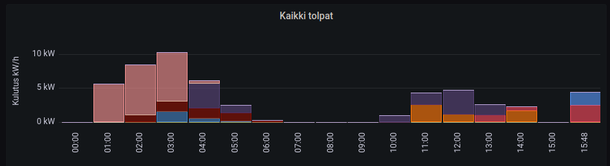

# Garo measure car charging

This repos is for measuring electric car charging while using Garo
charge stations. It can be one, or full network of chargers.


The script fetches data from all Garo stations in the network via the main Garo box.
There needs to be network connection to Garo station. The easiest way is to
connect to wlan of Garo box (there is RaspberryPi inside). And yes, you need to have it with the wlan module.

The script fetches each boxes serial number and reference name
and uses them as influxdb tags. The data field is the energy
consumption. So it keeps increasing immediately when you start
charing. Unit is 1 kW.

Program exits after sending data once. You need to keep calling
it from systemd timer or cron to get values periodicly.


There needs to be garo2influxdb.ini with connection details.
See the [garo2influxdb-example.ini](./garo2influxdb-example.ini).

To create this env, do e.g.

```
mkdir src; cd src
git clone git@github.com:ikke-t/garo-measure-car-charging.git garo
cd garo
python3 -m venv virtualenv
source virtualenv/bin/activate
pip install influxdb-client
cp garo2influxdb-example.ini garo2influxdb.ini
```
and edit your ini file to have garo address, and influxdb authentication and url info.

# Grafana view



The example screenshot from grafana is taken using this flux query:

```
import "experimental/aggregate"
from(bucket: "electric")
  |> range(start: v.timeRangeStart, stop: v.timeRangeStop)
  |> filter(fn: (r) => r["_measurement"] == "garos")
  |> filter(fn: (r) => r["_field"] == "accEnergy")
  |> increase()
  |> aggregateWindow(every: 1h, fn: spread, createEmpty: true)
  |> map(fn: (r) => ({r with _value: float(v: r._value) / 1000.0}))
  |> drop(columns: ["serialNumber", "_measurement"])
```

# Make it run periodicly

Here are systemd example files for running this periodicly. The [garo2influxdb.service](./garo2influxdb.service) file defines the service, check the paths apply to your setup. Then the correspondig [garo2influxdb.timer](./garo2influxdb.timer) makes it run every 5 mins. Write the file to your home dir, and make systemd aware of them, and set linger to your user so they keep running after you log out. Here is example running them as pi user:

```
systemctl --user daemon-reload
systemctl --user enable --now garo2influxdb.service
systemctl --user enable --now garo2influxdb.timer
sudo loginctl enable-linger pi
```

This keeps feeding the influxdb every 5 mins.